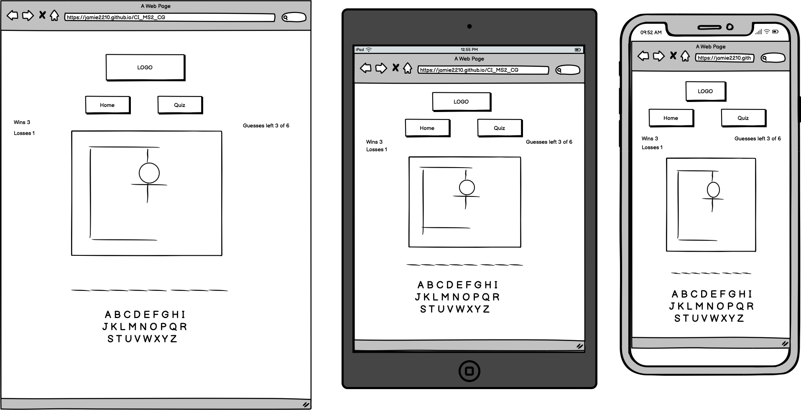
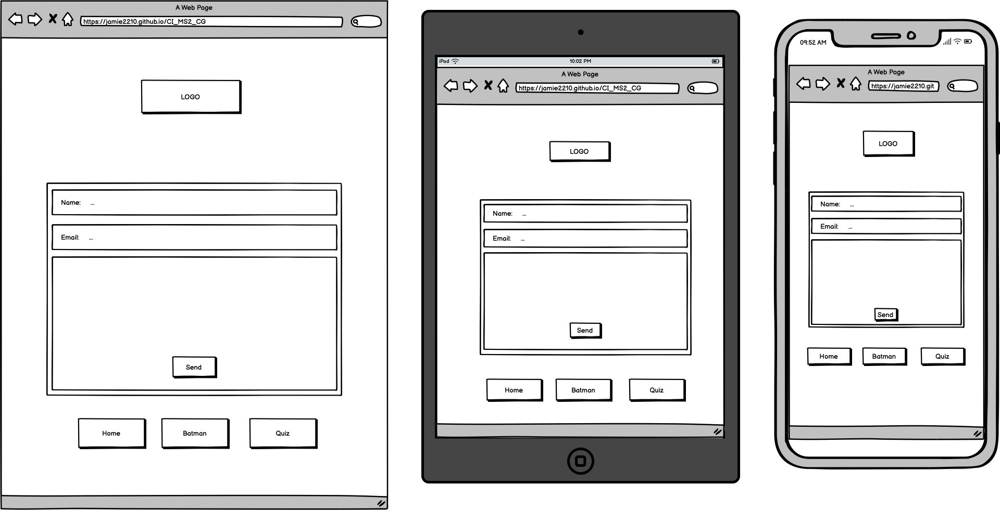
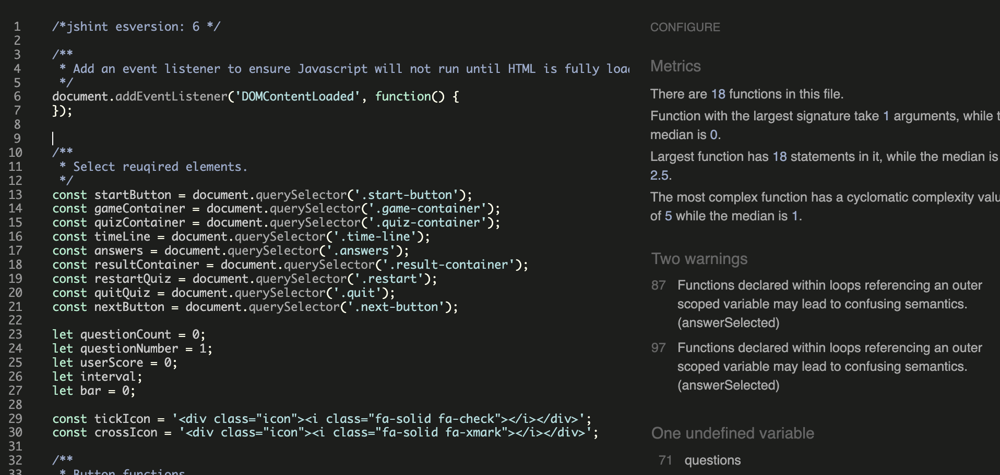

# DC Games
(Developer: Jamie Letts)

[Live webpage](https://jamie2210.github.io/CI_MS2_DCG/index.html)

This is the website for DC Games, it is designed to be responsive and accessible on all devices. It consists of 2 games, a hangman game, and a multiple-choice quiz. Both games are themed around the comic Batman.

## Table of Content

1. [Project Goals](#project-goals)
    1. [User Goals](#user-goals)
    2. [Site Owner Goals](#site-owner-goals)
2. [User Experience](#user-experience)
    1. [Target Audience](#target-audience)
    2. [User Requirements and Expectations](#user-requrements-and-expectations)
    3. [User Stories](#user-stories)
3. [Design](#design)
    1. [Design Choices](#design-choices)
    2. [Colour](#colours)
    3. [Fonts](#fonts)
    4. [Structure](#structure)
    5. [Wireframes](#wireframes)
4. [Technologies Used](#technologies-used)
    1. [Languages](#languages)
    2. [Frameworks & Tools](#frameworks-&-tools)
5. [Features](#features)
6. [Testing](#validation)
    1. [HTML Validation](#HTML-validation)
    2. [CSS Validation](#CSS-validation)
    3. [JavaScript Validation](#javascript-validation)
    4. [Accessibility](#accessibility)
    5. [Performance](#performance)
    6. [Device testing](#performing-tests-on-various-devices)
    7. [Browser compatibility](#browser-compatability)
    8. [Testing user stories](#testing-user-stories)
8. [Bugs](#bugs)
9. [Deployment](#deployment)
10. [Credits](#credits)
11. [Acknowledgements](#acknowledgements)

## Project Goals

Primary goal is to provide a user-friendly, fun, and good-looking interactive website which offers the game Hangman and a multiple-choice quiz.

### User Goals
- Play both games that are fun and engaging.
- Easily find the rules of each game.
- Easily get in touch via a contact form.

### Site Owner Goals
- Create a website with entertaining games.
- Create visually appealing designs throughout.
- Easy navigation throughout.
- Provide a fully responsive and accessible design. 

### Developer Goals
- A clean design that stands out and catches the users attention.
- A website that responds correctly on all devices where design and effectiveness is not hindered on any device.
- An easy to navigate website with clear pathways to specific pages such as rules, each game, home, and contact.

## User Experience

### Target Audience
- Ages 8 to 12.
- It is specific to those who have an in interest in DC comics, particularly Batman.

### User Requirements and Expectations

- A simple and intuitive navigation system.
- Quickly and easily find relevant information.
- Links and functions that work as expected.
- Good presentation and a visually appealing design regardless of device used.
- Easy to follow the games and rules.
- Simple content that the user can follow and understand.
- An easy way to contact the developer for feedback.
- Accessibility.

### User Stories

#### Site User (General)
1. I want to easily understand the rules of each game.
2. I want to easily navigate to my chosen game.
3. I want the games to be fun, enjoyable and easy to understand.
4. I want to know how I did at the end of each game.
5. I want a means to contact the developer and have confirmation the message has been sent.

##### Hangman
6. I want to play the game both by clicking the mouse and using the keyboard.
7. I want to know which letters I’ve used already.
8. I want to know how many guesses I have left.
9. I want the gallows image to add on sections of the hangman each time a letter is guessed incorrectly.
10. I see to my score of wins vs losses.
11. I want the word to be revealed if I don’t guess it.

##### Quiz
12. I want to know how time is left to answer the question.
13. I want to know which answer is correct if answered incorrectly.
14. I want to know the answer if I run out of time.
15. I want to see my score at the end.
16. I want to easily play again or quit once I have finished.

#### Site Owner 
17. I want the user to get a genuine feel this is a DC Batman themed site. 
18. I want the user to easily understand and play the games.
19. I want both games to be fully responsive.
20. While some users may want the word revealed if it is not guessed in Hangman, the words are limited so to increase the difficulty and longevity of the game, the word will not be revealed.
21. I want the user to be able to contact me for any reason they feel fit.
22. I want the user to come to a 404 page and be automatically re-directed to the home page should they enter an invalid url.
23. I want the user to have a link to my work via my Github respositories. 

## Design

### Design Choices
The design has been influenced by the comics like keeping the buttons square and grey to present comments in comic books. Each game has been designed around the colours and personality of the characters in the comics. 

### Colour

DC uses a specific blue which is used sparingly throughout the website.

Batman colours are predominantly black and yellow.

Both The Riddler and Joker are themed by purples and greens.

Colours Used

### Fonts

Google fonts were used to import the ‘Anton’ font used with a sans-serif fallback throughout the website:

- [Anton]( https://fonts.google.com/specimen/Anton?query=anton)

I chose this font as it stood out to me as a strong and bold font that represented Batman well. It is also easy to read which is good for the target audience.

### Structure
The page is structured in a user friendly and visually appealing way. Upon arriving the user will see a simple display with clear instructions to what the site offers and where to find the rules of each game.

The website consists of four separate pages with rules and result modals: 
- A homepage with a with clear navigation to the games and rules.
- The Batman Hangman game page
- The Riddler’s Quiz game page.
- A contact page with a form that will directly send messages to the developer.
- Modals with the rules of each game.
- There is also a 404 page that directs the user back to the home.

### Wireframes

Home

Batman Hangman

The Riddler’s quiz

The Rules

Contact

404

## Technologies Used

### Languages
- [HTML](https://en.wikipedia.org/wiki/HTML)
- [CSS](https://en.wikipedia.org/wiki/CSS)
- [Javascript](https://en.wikipedia.org/wiki/JavaScript)

### Frameworks and Tools
- [Bootstrap v5.3](https://getbootstrap.com/)
- [Git](https://git-scm.com/)
- [Github](https://github.com/)
- [GitPod](https://www.gitpod.io/)
- [Tiny PNG](https://tinypng.com/)
- [Balsamiq](https://balsamiq.com/wireframes/)
- [Google Fonts](https://fonts.google.com/about)
- [Adobe Suite (Illustrator, Photoshop & InDesign)](https://www.adobe.com/uk/)
- [Font Awesome](https://fontawesome.com/search)
- [Favicon](https://favicon.io/)
- [Giphy](https://giphy.com/)
- [W3C validator](https://validator.w3.org/)
- [Jigsaw CSS validator](https://jigsaw.w3.org/css-validator/)
- [WAVE Web Accessibility Evaluation Tool](https://wave.webaim.org/)

## Features
The page consists of four pages and eleven features.

### Home Page

#### DC Logo and introduction

- Upon arriving to the site a welcome modal pops up.
- It details where to find the games, the rules and contact informaton.
- The rules are modals accessed by clicking the '?' symbols.
- The logo is DC's official logo.
- User stories covered:  1, 2, 3, 5, 17 & 18.

Intro

#### Navigation Buttons & Character Images (Navigation buttons featured on all pages)
- Both the Batman and Riddler characters are that of The Batman animated series, which the games are based on.
- Navigation buttons are featured on all pages, they all have squared edges to represent sections and comments of a comic.
- Link to each game and the home page.
- It allows users to easily navigate through the website.
- The buttons are animated depending on which page they are on, matching the themes .
- User stories covered: 2, 5, & 17.

Buttons & Characters

#### Rules Modal
- Clicking the question mark under the selected character will bring up the rules for that game.
- User stories covered: 1.

Modal

#### Footer (displayed on all pages)
- Featured on all pages.
- Details who the developer is, a link to Github and contact page.
- User stories covered: 5, 21 & 23.

Footer

### Batman Hangman

#### Game Function & Game Screen
- Consists of empty gallows, empty score, and number of wrong guesses left.
- Letter tabs for entry guesses, allows user to use either mouse or keyboard for entries.
- If the letter is guessed correclty the letter is revealed in replace of the '_'
- If the phrase is guessed correctly a modal is presented confirming the win with the total number of wins and losses.
- If the letter is guessed incorreclty the hangman image increases as does the number of wrong guesses.
- If the phrase is guessed incorreclty a modal is presented confirming the loss with the total number of wins and losses.
- On pressing a letter it is highlighted yellow and then greyed out once used, cannot be used again.
- Reset button resets the game but keeps track the total wins and losses until page is refreshed.
- The theme of the game is Batman and The Joker and all colours, wording and design are based on the animated series.
- A comical element has been added to the results modal which is light hearted fun and plays on the characters in the game.
- User stories covered: 6, 7, 8, 9 10, 17, 19 & 20.
- User story not covered: 11. This is puprosely done to incresse the longevity and diffuclty of the game.

#### Win Modal
- Displays current score, wins v losses.
- Close Button that resets the game.
- User stories covered: 4, 10 & 20.

#### Lose Modal
- Displays current score, wins v losses.
- Close Button that resets the game.
- User stories covered: 4, 10 & 20.

Game Screen

Win Modal

Lose Modal

### The Riddler’s Quiz

#### Game Function & Game Screen
- Start Button.
- Navigation buttons.
- The game is themed in the colours of The Riddler, green and purple.
- Game modal is presented once start button is pressed.
- Game consists of a timer, time bar and multiple choice questions the user can click to select.
- When a question is answered correctly it is highlighted in green with a tick icon.
- When a question is answered incoorectly it is highlighted in black with a cross icon.
- At the end fo the game the score is tallied and revealed in a modal.
- A comical element has been added to the results modal which is light hearted fun and plays on the characters in the game.
- User stories covered: 3, 12, 13 & 14.

#### Results Modal
- Displays score.
- Replay button that resets the game.
- Quit button that refreshes the page.
- User Stories covered: 4, 15 & 16.

Game Screen

Game Modal

Results Modal

### Contact Form Page

- Allows user to directly contact the developer
- Alert box pops up when message has been sent successfully.
- User stories covered: 5 & 21.

Contact Form

### 404
- Explains to the user they have landed on an unrecognised page.
- It automatically returns the user back to the home page after 10 seconds, detailed by a count down.
- There is also a home button should user wish to use it.
- User Stories covered: 22.

404 Page

## Testing

### HTML Validation

The W3C Markup Validation Service was used to validate the HTML of the website. All pages pass with no errors.

index.html [results](https://validator.w3.org/nu/?doc=https%3A%2F%2Fjamie2210.github.io%2FCI_MS2_DCG%2Findex.html)

hangman.html [results](https://validator.w3.org/nu/?doc=https%3A%2F%2Fjamie2210.github.io%2FCI_MS2_DCG%2Fhangman.html) 

quiz.html [results](https://validator.w3.org/nu/?doc=https%3A%2F%2Fjamie2210.github.io%2FCI_MS2_DCG%2Fquiz.html) 

contact.html [results](https://validator.w3.org/nu/?doc=https%3A%2F%2Fjamie2210.github.io%2FCI_MS2_DCG%2Fcontact.html) 

404.html [results](https://validator.w3.org/nu/?doc=https%3A%2F%2Fjamie2210.github.io%2FCI_MS2_DCG%2F404.html)

### CSS Validation
The W3C Jigsaw CSS Validation Service was used to validate the CSS of the website.
When pasting in my index url 16 Parse Errors are flagged, all linked to Bootstrap as well as 286 warnings.

style.css [results](https://jigsaw.w3.org/css-validator/validator?uri=https%3A%2F%2Fjamie2210.github.io%2FCI_MS2_DCG%2Findex.html&profile=css3svg&usermedium=all&warning=1&vextwarning=&lang=en)
 

When validating just my own custom CSS file it passes with no errors and flagged three warnings using pointer-events twice used and 1 warning for the google fonts import used.

style.css

### JavaScript Validation

JSHint JS Validation Service was used to validate the Javascript files. No significant issues were found. One undefined Variable found in quiz.js for the questions variable used as it's linked to a separate file.

OnClick buttons were flagged as unused but /* exporte */ feature was used to remove the flags as they are called in the html files.

index.js

hangman.js

questions.js

quiz.js

contact.js

404.js

### Accessibility
The WAVE WebAIM web accessibility evaluation tool was used to ensure the website met high accessibility standards. All pages pass with 0 errors apart from quiz.html that has 3. They are all contrasting errors to which I disagree with, the white on purple to me is perfectly visible and matches the colour scheme so have chosen to leave it as it is.

index.html [results](https://wave.webaim.org/report#/https://jamie2210.github.io/CI_MS2_DCG/index.html) 

hangman.html [results](https://wave.webaim.org/report#/https://jamie2210.github.io/CI_MS2_DCG/hangman.html)

quiz.html [results](https://wave.webaim.org/report#/https://jamie2210.github.io/CI_MS2_DCG/quiz.html)

contact.html [results](https://wave.webaim.org/report#/https://jamie2210.github.io/CI_MS2_DCG/contact.html)

404.html [results](https://wave.webaim.org/report#/https://jamie2210.github.io/CI_MS2_DCG/404.html)

### Performance 
Google Lighthouse in Google Chrome Developer Tools was used to test the performance of the website. All results scoring 95 or above.

index.html

hangman.html

quiz.html

contact.html

404.html

### Performing tests on various devices 
The website was tested on the following devices:
- MacBook Pro
- Ipad Tablet
- Google Pixel 5
- Iphone 12

In addition, the website was tested using Google Chrome Developer Tools device toggle option for all available device options.

### Browser compatibility
The website was tested on the following browsers:
- Google Chrome
- Apple Safari
- Mozilla Firefox

